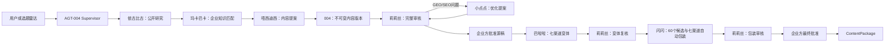

# AGT-RSN-004：艾氪智能内容生产团队

> 当前版本：`v5.6.0-rc.1` · RC开发快照 · 纯内容域 · 8 个内部子智能体 · 本地文件可独立持久化

AGT-RSN-004 是 RISEN 家族的内容资产生产与管理智能体。它把选题、公开研究、企业知识、品牌规则和证据转化为经过审核、可追溯、可复用的内容资产。

如果你第一次打开这个仓库，只需要先记住三件事：

1. **004 负责内容从选题到交付，不负责发布和效果监测。**
2. **004 是 Supervisor，噜噜猫、依古比古、玛卡巴卡、唔西迪西、莉莉丝、小点点、巴啦啦和闪闪是内部子智能体。**
3. **当前 `v5.6.0` 已接入标题与内容包装智能体闪闪；8 个子智能体仍处于 `SHADOW`，尚未取得正式闸门执行资格。**

## 一分钟看懂项目



内容生命周期到 `ContentPackage` 或下游交付即结束。项目不会继续跟踪是否发布、何时发布或发布效果。

## 能做什么

- 用户指定主题后的公开资料研究；
- 每日资讯本地副本的去重、聚类和候选选题；
- ContentBrief、Outline、ResearchPack；
- 企业 AI、产业 AI、Agentic OS 和产品内容写作；
- 微信公众号、短视频/视频号、小红书、X/Twitter、LinkedIn、YouTube、播客变体与包装；
- 默认60个标题候选、渠道独立选择、封面文字、视频上方文字、Hook和标签；
- Claim—Evidence 绑定；
- 企业知识、品牌、合规、保密和案例口径检查；
- AI 味儿、逻辑、车轱辘话、叙事质量、内容完整度和企业融合审核；
- GEO/SEO 意图、问题覆盖和 AnswerBlock 优化；
- 不可变版本、人工闸门、审计和内容包导出；
- Codex 或 JovaAI 宿主模型适配；
- 本地文件模式，以及 PostgreSQL、Redis/BullMQ、S3/MinIO 生产模式。

## 明确不能做什么

- 不连接微信、小红书、X、抖音、TikTok、LinkedIn 等发布接口；
- 不保存平台账号、Token、Cookie 或发布凭据；
- 不发布、预约、撤回或重试发布；
- 不查询平台内容 ID、发布链接和发布状态；
- 不采集曝光、互动、转化和归因数据；
- 不执行内容效果监测；
- 不根据平台效果生成 `LearningProposal`；
- 不自动修改正式企业知识库；
- 不自动激活新的反馈规则或第三方 Skill；
- 不配置额外模型 API，也不使用 Mock 或 Prototype Fallback。

## 团队成员

| 中文名 | Agent ID | 职责 | 正式写版本/批准 |
|---|---|---|---|
| 004 | `agt-004` | 任务预检、调度、创建版本、打包和审计 | 可创建版本，不可代替企业方批准 |
| 噜噜猫 | `topic-radar` | 本地资讯雷达、去重、聚类和选题候选 | 不可 |
| 依古比古 | `public-researcher` | 公开只读研究、ResearchPack 和 Evidence | 不可 |
| 玛卡巴卡 | `makabaka` | 写前知识快照、融合计划、写后口径复查 | 不可 |
| 唔西迪西 | `content-orchestrator` | ContentBrief、Outline 和 DraftProposal | 不可 |
| 莉莉丝 | `lilith` | 事实、逻辑、AI 味、车轱辘话、叙事质量、品牌、保密和合规审核 | 不可自批 |
| 小点点 | `xiaodiandian` | GEO/SEO 问题优化 Proposal | 不可直接改正式稿 |
| 巴啦啦 | `balala` | 微信、短视频、小红书、X、LinkedIn 变体 | 不可绕过源稿批准 |
| 闪闪 | `packaging-copy-agent` | 七渠道标题、Hook、封面/视频文字、标签和自动选择 | 不可改正文、不可自审或批准 |

运行时权威登记在 [`agents/registry.v5.6.json`](agents/registry.v5.6.json)。代码、文档和 Registry 不一致时，启动校验会失败。

## 当前真实状态

| 项目 | 状态 |
|---|---|
| 当前代码版本 | `v5.6.0`（RC DEVELOPMENT） |
| 8 个 Handler | 已注册，8/8 |
| 子智能体 rolloutMode | 全部 `SHADOW` |
| 本地任务、Artifact、Checkpoint | 已持久化 |
| 人工批准闸门 | 已实现 |
| 自动恢复与幂等 | 已实现 |
| 当前 Codex 对话内协作测试 | 可运行 |
| 脱离对话的模型执行 | 需要部署方提供 `HOST_RUNTIME_MODULE` |
| PostgreSQL/Redis 真实故障演练 | 尚未完成 |
| 无人值守生产状态 | 尚未达到 |

因此，本地执行 `pnpm team:health` 时，如果没有宿主桥接，看到 `DEGRADED` 是预期结果。它表示历史数据和非模型校验可用，但模型任务不能脱离宿主自行执行；不表示 8 个 Handler 丢失。

完整投产差距见 [`docs/PRODUCTION_READINESS.md`](docs/PRODUCTION_READINESS.md)。

## 最快上手

### 1. 环境要求

- Node.js 22；
- pnpm 10.15.1；
- Python 3；
- Git；
- 执行模型任务时，需要 Codex 或 JovaAI 提供宿主模型能力。

### 2. 安装与校验

```powershell
git clone https://github.com/Selina2025-alt/RisenOS-new-AGT-004.git
cd RisenOS-new-AGT-004
corepack enable
pnpm install --frozen-lockfile
pnpm team:validate
pnpm test
pnpm typecheck
pnpm lint:boundaries
```

查看团队健康状态：

```powershell
pnpm team:health
```

没有配置宿主桥接时，预期结果是：

```text
registeredHandlers: 8
missingHandlers: 0
shadowAgents: 8
hostModelAvailable: false
status: DEGRADED
```

### 3. 在 Codex 或 JovaAI 中直接使用

把仓库作为工作区打开，让宿主优先读取：

```text
README.md
active_context.json
knowledge/00_知识库索引.md
agents/registry.v5.6.json
```

然后可以直接提出内容任务，例如：

```text
以艾氪智能官方视角，围绕“企业AI为什么演示好但落地难”完成：
公开研究 → 企业知识匹配 → 长文初稿 → 莉莉丝审核。
先停在源稿人工审核，不生成渠道变体。
```

宿主应把任务、研究、稿件和审核结果保存到 `missions/`，不能只在聊天消息中临时返回。

### 4. 独立 CLI 模型任务

`team:run`、`team:resume` 和 `team:decide` 需要部署方注入 `HOST_RUNTIME_MODULE`。004 不接收模型供应商 API Key。

```powershell
$env:AGT004_REPOSITORY_ROOT = (Get-Location).Path
$env:HOST_RUNTIME_MODULE = "D:\path\to\host-runtime-bridge.mjs"
pnpm team:health
```

宿主桥接契约见 [`docs/HOST_RUNTIME_INTEGRATION.md`](docs/HOST_RUNTIME_INTEGRATION.md)。完整命令参数见 [`docs/GETTING_STARTED_V5.5.1.md`](docs/GETTING_STARTED_V5.5.1.md)。

## 标准内容流程

```text
主题或选题批准
→ Mission Preflight
→ 确认“谁在说、对谁说、在哪里说”
→ PerspectiveContract
→ 依古比古公开研究
→ 玛卡巴卡知识快照与融合计划
→ 唔西迪西 DraftProposal
→ 004 创建不可变 ContentVersion
→ 玛卡巴卡写后复查
→ 莉莉丝完整审核
→ 必要时小点点 GEO/SEO Proposal
→ 莉莉丝复审
→ 企业方批准源稿
→ 巴啦啦七渠道变体
→ 莉莉丝变体复核
→ 闪闪生成60个候选并自动选择七渠道包装
→ 莉莉丝包装审核
→ 企业方最终批准
→ ContentPackage
```

必须经过的人工闸门：

- `PERSPECTIVE_CONFIRMED`；
- `SOURCE_DRAFT_APPROVED`；
- `FINAL_VARIANTS_APPROVED`；
- 出现知识冲突时的 `KNOWLEDGE_CONFLICT_DECIDED`。

人工批准绑定具体 Artifact Hash。内容发生变化后，旧批准自动失效。

标题、封面文字和视频上方文字不再设置独立人工闸门。人工仍可通过包装反馈或不可变 Override 覆盖自动选择；Override 不删除闪闪原始方案，并且不能绕过包装硬门槛和最终变体总批准。

## 仓库地图

```text
agents/          团队 Registry 与角色说明
apps/            API、Worker 和可选 Web 工作台
packages/        Contracts、Core、Adapters、Database
knowledge/       企业知识、正式口径、原始资料和派生知识包
intelligence/    本地资讯 Feed、选题雷达、评分和研究配置
missions/        内容任务的完整持久化过程
drafts/          独立内容版本和测试稿
review/          莉莉丝、小点点等审核和优化产物
variants/        已审核源稿派生的渠道变体
audit/           追加式审计记录
docs/            实施设计、上手指南、安全和投产清单
scripts/         TypeScript 运维、迁移和回放入口
tools/           Python 资料导入、知识构建、雷达和校验工具
```

更详细的文件导航见 [`docs/REPOSITORY_MAP_V5.5.1.md`](docs/REPOSITORY_MAP_V5.5.1.md)。

## 如何理解知识库

知识资料分为三层：

```text
knowledge/sources/raw/       原始来源，不等于可直接公开
knowledge/sources/ingested/  解析结果、来源哈希和完整度记录
knowledge/canon/             经冲突检测和人工确认的激活口径
```

重要规则：

- 原始资料进入 GitHub，不代表其中每句话都允许进入对外文案；
- `publicationDisposition = INTERNAL_SOURCE` 表示只能作为内部来源；
- 企业内容必须绑定 `KnowledgeSnapshot`；
- 事实必须绑定 Evidence；
- 旧知识不删除，而是标记 `SUPERSEDED`、`CONFLICTING` 或 `HISTORICAL`；
- 涉及 Nomos 时，以 [`knowledge/products/Nomos制度智能体_正式内容口径_V2.0.md`](knowledge/products/Nomos制度智能体_正式内容口径_V2.0.md) 和激活 Canon 为准。

当前知识入口是 [`active_context.json`](active_context.json)。

## 一个完整测试样本

仓库内保留了 V5.5.1 上岗测试全过程，包括研究、知识匹配、初稿、两轮修订、Claim 绑定、小点点复核和莉莉丝终审：

- [系列任务总目录](missions/SERIES-20260822-INDUSTRIAL-AI/)
- [“AI落地难”人类审阅稿](missions/SERIES-20260822-INDUSTRIAL-AI/drafts/BATCH-01/TOPIC-INDUSTRIAL-AI-002/revision-2/human-review-copy.md)
- [“为什么聚焦实体产业”人类审阅稿](missions/SERIES-20260822-INDUSTRIAL-AI/drafts/BATCH-01/TOPIC-INDUSTRIAL-AI-001/revision-2/human-review-copy.md)
- [莉莉丝最终复审](missions/SERIES-20260822-INDUSTRIAL-AI/review/BATCH-01/revision-2/)

这两篇目前是 `READY_FOR_HUMAN_SOURCE_REVIEW`，不是已批准发布内容。

## 常用命令

```powershell
# 团队定义、Handler 与 rolloutMode 一致性
pnpm team:validate

# 团队健康状态
pnpm team:health

# 全量验证
pnpm test
pnpm typecheck
pnpm lint:boundaries
pnpm build

# Nomos 知识包验证
python tools/validate_nomos_canon.py

# 每日雷达
python tools/build_daily_radar.py

# V5.5 历史任务回放
pnpm replay:v55

# 查看闪闪包装结果（完整候选池、七渠道选择和莉莉丝结论）
pnpm packaging:show -- <runId> <organizationId>

# 仅在人工明确要求更新公开标题趋势时使用；先经依古比古受限研究
pnpm packaging:generate -- <runId> <organizationId> PUBLIC_PATTERN_PACK
```

## 版本与回滚

- 当前工作区版本：`v5.6.0-rc.1`（实施分支，发布说明见 [`docs/RELEASE_NOTES_V5.6.0.md`](docs/RELEASE_NOTES_V5.6.0.md)）；
- 当前回滚基线：[`v5.5.2`](https://github.com/Selina2025-alt/RisenOS-new-AGT-004/tree/v5.5.2)；
- 上一Git快照：[`v5.5.1`](https://github.com/Selina2025-alt/RisenOS-new-AGT-004/tree/v5.5.1)；
- 前一稳定快照：[`v5.3.1`](https://github.com/Selina2025-alt/RisenOS-new-AGT-004/tree/v5.3.1)；
- V5.5.1 上线前归档：[`archive-main-v5.3.1-before-v5.5.1-20260822`](https://github.com/Selina2025-alt/RisenOS-new-AGT-004/tree/archive-main-v5.3.1-before-v5.5.1-20260822)。

回滚代码不能删除新版本已生成的任务、Artifact 和审计记录。项目版本、内容版本、知识包版本和Prompt/Skill版本不得混用，规则见 [`docs/VERSIONING_POLICY.md`](docs/VERSIONING_POLICY.md)。

## 权威文档

阅读顺序建议：

1. 本 README；
2. [`docs/RELEASE_NOTES_V5.6.0.md`](docs/RELEASE_NOTES_V5.6.0.md)；
3. [`docs/VERSIONING_POLICY.md`](docs/VERSIONING_POLICY.md)；
4. [`docs/GETTING_STARTED_V5.5.1.md`](docs/GETTING_STARTED_V5.5.1.md)；
5. [`docs/REPOSITORY_MAP_V5.5.1.md`](docs/REPOSITORY_MAP_V5.5.1.md)；
6. [`docs/IMPLEMENTATION_PLAN_V5.5.md`](docs/IMPLEMENTATION_PLAN_V5.5.md)；
7. [`docs/IMPLEMENTATION_PLAN_V5.5.1.md`](docs/IMPLEMENTATION_PLAN_V5.5.1.md)；
8. [`docs/IMPLEMENTATION_PLAN_V5.6.0.md`](docs/IMPLEMENTATION_PLAN_V5.6.0.md)；
9. [`docs/PRODUCTION_READINESS.md`](docs/PRODUCTION_READINESS.md)。

V5.3 文档保留为底层持久化历史设计。V5.5定义内容和知识治理，V5.5.1定义统一团队运行接线，V5.5.2定义莉莉丝重复/叙事闸门与强制版本制度，V5.6.0定义闪闪及标题包装闭环；发生冲突时，以最新版本的Release Notes和权威实施文档为准。

## 资料与许可说明

本仓库包含企业知识、会议记录、产品资料和内容生产过程，不应把“可以访问仓库”等同于“可以公开传播全部内容”。任何对外使用仍须遵守知识卡、保密规则、版权状态和企业方人工批准。

仓库目前没有开放源代码许可证。除非权利方另行授权，访问仓库不代表获得复制、分发或商业使用许可。
